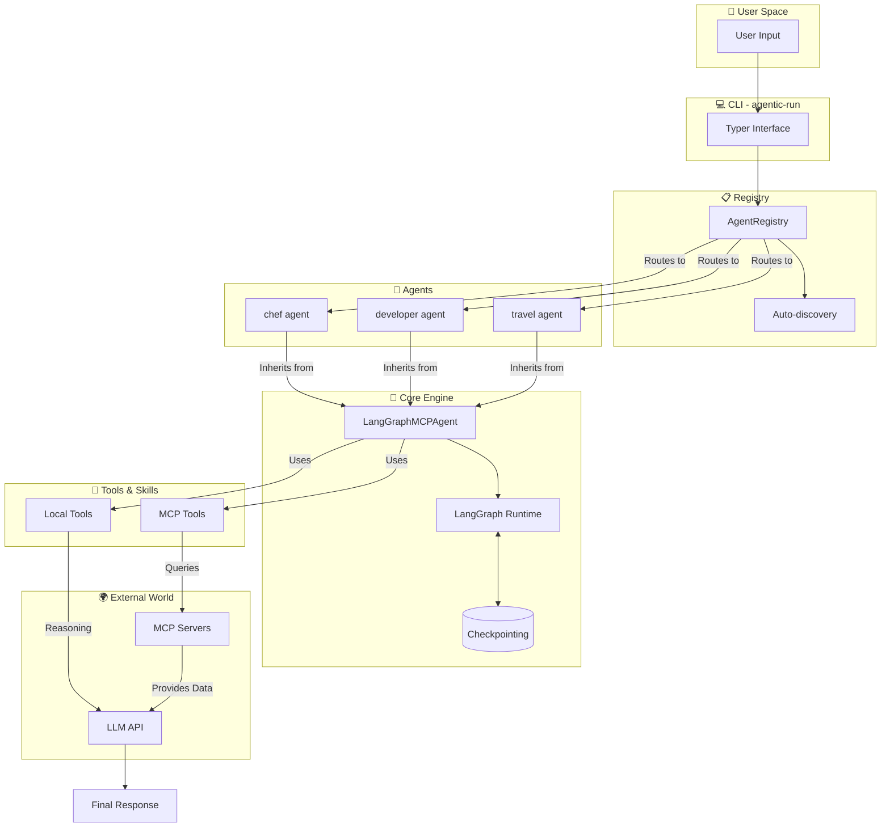

<div align="center">

# 🤖 Agentic Framework
**Build AI agents that *actually* do things.**

[](https://python.org)
[](https://python.langchain.com/)
[](https://modelcontextprotocol.io/)
[](https://www.docker.com/)
[](LICENSE)
[](https://github.com/jeancsil/agentic-framework/actions)
[](https://github.com/jeancsil/agentic-framework)

<br>

Combine **local tools** and **MCP servers** in a single, elegant runtime.  
Write agents in **5 lines of code**. Run them anywhere.

[Quick Start](#-quick-start-zero-to-agent-in-60s) • [Build an Agent](#-build-your-own-agent) • [Architecture](#-architecture) • [Demo](#-see-it-in-action)

</div>

---

## 🎬 See it in Action

<p align="center">
  <a href="https://asciinema.org/a/YOUR_CAST_ID_HERE" target="_blank">
    
  </a>
</p>

> 💡 *Pro-tip: Record your own demo with `asciinema rec` and replace the embed above!*

Run a specialized agent for codebase exploration:

## ✨ Why Agentic Framework?

| ⚡ Rapid Prototyping | 🐋 Production Isolation | 🔌 Protocol Native |
|---|---|---|
| **Zero-Config Registry.** Register agents with a single decorator. Auto-discovers in CLI. | **Docker-First.** Every agent is isolated. No "it works on my machine" excuses. | **MCP Ready.** Native support for the Model Context Protocol ecosystem. |

| 🧬 Stateful Runtimes | 🧩 Multi-Agent Mesh | ⚡ Codebase Context |
|---|---|---|
| **LangGraph Core.** Supports checkpointing, cycles, and human-in-the-loop. | **Orchestration.** Chain specialized agents like Lego blocks for complex tasks. | **Local Power Tools.** Integrated `ripgrep`, `fd`, and AST parsing for real context. |

# Access logs (same location as local)
tail -f agentic-framework/logs/agent.log
```

## 🚀 Quick Start (Zero to Agent in 60s)

### 1️⃣ Add your Brain (API Key)
You need an **LLM API key** to breathe life into your agents.

```bash
# Copy the template
cp .env.example .env

# Edit .env and paste your OpenAI key
# OPENAI_API_KEY=sk-your-key-here
```
> ⚠️ **Note:** At minimum, set `OPENAI_API_KEY`. Without it, your agents will sleep forever! 💤

### 2️⃣ Build & Run
No `pip`, no `virtualenv`, no *"it works on my machine"* excuses.

```bash
# Clone the repository
git clone https://github.com/jeancsil/agentic-framework.git
cd agentic-framework

# Build the Docker image
make docker-build

# Unleash your first agent!
bin/agent.sh developer -i "Explain this codebase"

# Or try the chef agent
bin/agent.sh chef -i "I have chicken, rice, and soy sauce. What can I make?"
```

<details>
<summary><strong>🔑 Required Environment Variables</strong></summary>

| Variable | Required? | Description |
|----------|-----------|-------------|
| `OPENAI_API_KEY` | 🟢 **Yes** | OpenAI API key (required for all agents) |
| `OPENAI_MODEL_NAME` | ⚪ No | Model to use (default: `gpt-4o`/`gpt-4`) |

</details>

---

## 🏗️ Architecture

Under the hood, we seamlessly bridge the gap between user intent and execution:



**How it works:**

## 🧰 Built-in Agents & Tools

### 🤖 Agents

| Agent | Purpose | MCP Servers | Local Tools |
|-------|---------|-------------|-------------|
| `developer` | **Codebase Master:** Explores, reads, and edits code safely. | `webfetch` | `find_files`, `discover_structure`, `get_file_outline`, `read_file_fragment`, `code_search`, `edit_file` |
| `travel-coordinator` | **Trip Planner:** Orchestrates multiple agents for seamless travel planning. | `kiwi-com-flight-search`, `webfetch` | *Orchestrates 3 sub-agents* |
| `chef` | **Culinary Genius:** Creates recipes based on what's in your fridge. | *web search via MCP* | `web_search` |
| `news` | **News Anchor:** Aggregates top stories. | `webfetch` | - |
| `travel` | **Flight Booker:** Finds the best routes. | `kiwi-com-flight-search` | - |
| `simple` | **Chat Buddy:** Basic conversational agent. | - | - |

### 📦 Local Tools (Zero External Dependencies)

| Tool | Capability | Example |
|------|------------|---------|
| `find_files` | Lightning-fast search via `fd` | `*.py` finds all Python files |
| `discover_structure` | Directory tree mapping | Understands project layout |
| `get_file_outline` | AST-based signature parsing | Extracts classes and functions |
| `read_file_fragment` | Precise file reading | `file.py:10:50` |
| `code_search` | Hyper-fast text search via `ripgrep`| Global regex search |
| `edit_file` | Safe file editing | Inserts/Replaces lines |

### 🌐 MCP Servers (Context Superpowers)

| Server | Purpose | API Key Needed? |
|--------|---------|-----------------|
| `kiwi-com-flight-search` | Search real-time flights | 🟢 No |
| `webfetch` | Extract clean text from any URL | 🟢 No |

- `agentic-framework/src/agentic_framework/core/langgraph_agent.py`: reusable base class for most agents
- `agentic-framework/src/agentic_framework/mcp/config.py`: all available MCP servers
- `agentic-framework/src/agentic_framework/registry.py`: agent registration + allowed MCP servers
- `agentic-framework/src/agentic_framework/cli.py`: command runner and error handling

## 🛠️ Build Your Own Agent

### The 5-Line Superhero 🦸‍♂️

```python
from agentic_framework.core.langgraph_agent import LangGraphMCPAgent
from agentic_framework.registry import AgentRegistry

@AgentRegistry.register("my-agent", mcp_servers=["webfetch"])
class MyAgent(LangGraphMCPAgent):
    @property
    def system_prompt(self) -> str:
        return "You are my custom agent with the power to fetch websites."
```

Boom. Run it instantly:
```bash
bin/agent.sh my-agent -i "Summarize https://example.com"
```

### Advanced: Custom Local Tools 🔧

Want to add your own Python logic? Easy.

```python
from langchain_core.tools import StructuredTool
from agentic_framework.core.langgraph_agent import LangGraphMCPAgent
from agentic_framework.registry import AgentRegistry

@AgentRegistry.register("data-processor")
class DataProcessorAgent(LangGraphMCPAgent):
    @property
    def system_prompt(self) -> str:
        return "You process data files like a boss."

    def local_tools(self) -> list:
        return [
            StructuredTool.from_function(
                func=self.process_csv,
                name="process_csv",
                description="Process a CSV file path",
            )
        ]

    def process_csv(self, filepath: str) -> str:
        # Magic happens here ✨
        return f"Successfully processed {filepath}!"
```

---

## 💻 CLI Reference

Command your agents directly from the terminal.

```bash
# 📋 List all registered agents
bin/agent.sh list

# 🕵️ Get detailed info about what an agent can do
bin/agent.sh info developer

# 🚀 Run an agent with input
bin/agent.sh developer -i "Analyze the architecture of this project"

# ⏱️ Run with an execution timeout (seconds)
bin/agent.sh developer -i "Refactor this module" -t 120

# 📝 Run with debug-level verbosity
bin/agent.sh developer -i "Hello" -v
```

---

## 🧑‍💻 Local Development

Prefer running without Docker? We got you.

<details>
<summary><strong>System Requirements & Setup</strong></summary>

**Requirements:**
- Python 3.12+
- `ripgrep`, `fd`, `fzf`

```bash
# Install dependencies (blazingly fast with uv ⚡)
make install

# Run the test suite
make test

# Run agents directly in your environment
uv --directory agentic-framework run agentic-run developer -i "Hello"
```
</details>

<details>
<summary><strong>Useful `make` Commands</strong></summary>

```bash
make install    # Install dependencies with uv
make test       # Run pytest with coverage
make format     # Auto-format codebase with ruff
make check      # Strict linting (mypy + ruff)
```
</details>

---

## 🤝 Contributing

We love contributions! Check out our [AGENTS.md](AGENTS.md) for development guidelines.

**The Golden Rules:**
1. `make check` should pass without complaints.
2. `make test` should stay green.
3. Don't drop test coverage (we like our 80% mark!).

---

## 📄 License

This project is licensed under the **MIT License**. See [LICENSE](LICENSE) for details.

---

<p align="center">
  <strong>Stand on the shoulders of giants:</strong><br><br>
  <a href="https://python.langchain.com/"></a>
  <a href="https://modelcontextprotocol.io/"></a>
  <a href="https://github.com/langchain-ai/langgraph"></a>
</p>

<p align="center">
  If you find this useful, please consider giving it a ⭐!<br><br>
  <a href="https://github.com/jeancsil/agentic-framework/stargazers">
    
  </a>
</p>
